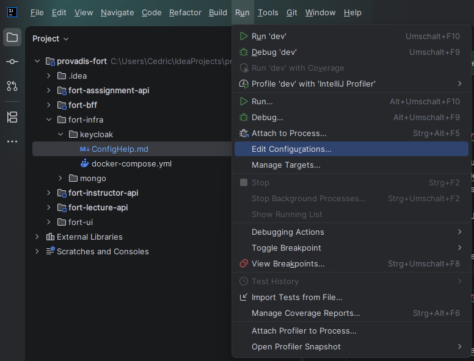
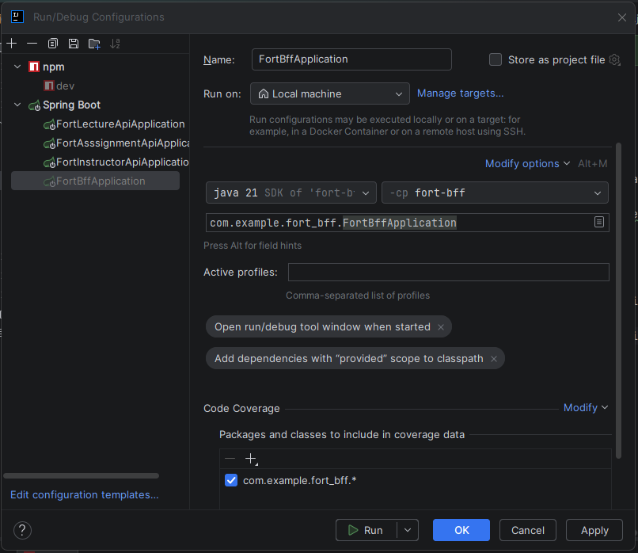
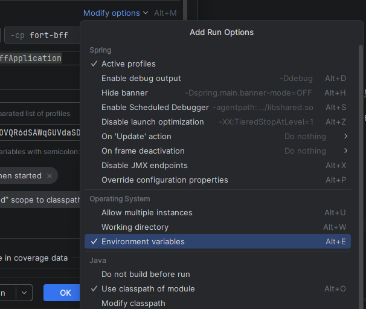
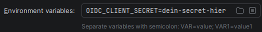

# Keycloak-Konfiguration für das FORT-Projekt

Diese Anleitung beschreibt die lokale Einrichtung von Keycloak für das Projekt.

## 1. Keycloak starten

Im Projektverzeichnis ausführen:

```bash
cd fort-infra/keycloak
docker compose up
```

Danach ist Keycloak lokal unter folgender Adresse erreichbar:

```text
http://localhost:9000
```

Zum Einloggen in das Adminpanel:
* **Nutzername:** ``admin``
* **Passwort:** ``admin``

## 2. Realm anlegen

1. Keycloak im Browser öffnen: `http://localhost:9000`
2. Zu **Manage realms** gehen
3. **Create realm** auswählen
4. Als Namen eintragen:

```text
fort
```

## 3. Client anlegen

1. Zu **Clients** gehen
2. **Create client** auswählen
3. Als **Client ID** eintragen:

```text
fort-bff
```

4. **Next** klicken

### Client-Einstellungen

Die folgenden Optionen setzen:

- **Client Authentication:** On
- **Authorization:** Off
- **Standard Flow:** On

Danach wieder **Next** klicken.

## 4. Client-URLs konfigurieren

Folgende Werte eintragen:

**Root URL**

```text
http://localhost:8084
```

**Home URL**

```text
http://localhost:8084
```

**Valid redirect URIs**

```text
http://localhost:8084/login/oauth2/code/fort
```

**Valid post logout redirect URIs**

```text
http://localhost:8084
```

Für Kompatibilität mit dem Frontend zusätzlich:
```text
http://localhost:5173/login
```

**Web Origins**

Für lokales Testen:

```text
http://localhost:8084
```

Wenn ein separates Frontend verwendet wird, stattdessen den Frontend-Port eintragen, zum Beispiel:

```text
http://localhost:5173
```

## 5. Client Secret kopieren

1. Im angelegten Client auf **Credentials** gehen
2. Das **Client Secret** kopieren
3. In die `.env`-Datei des BFFs einfügen

### Für IntelliJ-Nutzer:
In manchen Fällen erkennt IntelliJ die ``.env``-Datei nicht korrekt, was zu einem falschen oder fehlenden Secret führt, sodass der Login fehlschlägt.

Als Lösung lässt sich das Secret direkt in der Spring-Konfiguration des BFFs in IntelliJ setzten:

1. Klicke unter "Run" auf die Option "Edit Configurations...".


2. Wähle in der linken Seitenleiste unter "Spring Boot" die Konfiguration "FortBffApplication".


3. Ggf. muss unter "Modify Options" die Sichtbarkeit der Option "Environment Variables" aktiviert werden.


4. Das Secret lässt sich in das neue Feld einfügen: ```OIDC_CLIENT_SECRET=dein-secret-hier```



## 6. Testbenutzer anlegen

1. Zu **Users** gehen
2. **Add User** auswählen
3. Als Benutzername eintragen:

```text
testuser
```

4. Benutzer speichern
5. Danach zu **Credentials** gehen
6. Ein Passwort setzen
7. **Temporary** deaktivieren

## 7. Login testen

Danach sollte der Login funktionieren unter:

```text
http://localhost:8084/login
```

Hinweis: Nach erfolgreichem Login zeigt der Endpoint `http://localhost:8084/auth/me` die Nutzerdaten an.

## 8. Logout testen

Logout ist erreichbar unter:

```text
http://localhost:8084/logout
```

## 9. Wichtiger Hinweis zu IntelliJ und `.env`

Unbedingt sicherstellen, dass IntelliJ wirklich die richtige `.env`-Datei verwendet.

Für einen möglichen Lösungsansatz siehe: [5. Client Secret kopieren -> Für IntelliJ-Nutzer](#Für-IntelliJ-Nutzer)

Gerade bei Login- oder Logout-Problemen liegt die Ursache oft daran, dass:

- die falsche `.env` geladen wird
- das `client secret` nicht aktuell ist
- die Anwendung ohne die erwarteten Environment-Variablen gestartet wurde

## Kurzüberblick

### Keycloak
- URL: `http://localhost:9000`
- Realm: `fort`
- Client ID: `fort-bff`

### Anwendung
- App URL: `http://localhost:8084`
- Login: `http://localhost:8084/login`
- Logout: `http://localhost:8084/logout`

### Redirects
- Redirect URI: `http://localhost:8084/login/oauth2/code/fort`
- Post Logout Redirect URI: `http://localhost:8084`

### Testuser
- Username: `testuser`
- Passwort: manuell unter **Credentials** setzen
